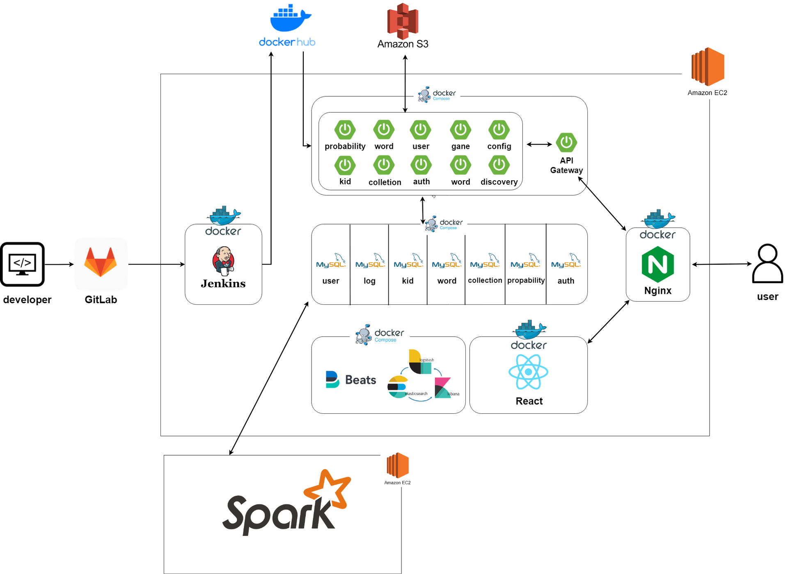
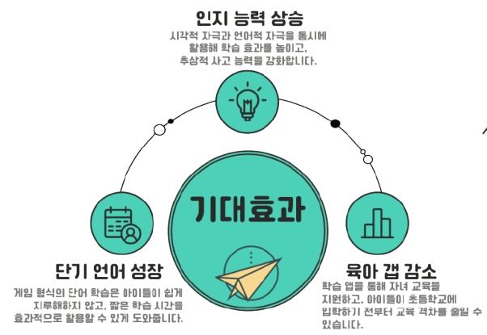

# Hello Word

<h1 align="center">
  

  <div>영유아를 위한 단어 학습 앱</div>
</h1>

<br>

# :one: 프로젝트 개요

## 1. 개발 기간

| 개발기간 | 24.08.19 ~ 24.10.11 |
| -------- | ------------------- |

## 2. 구성 팀

| 팀원   | 역할                | 세부 내용      |
| ------ | ------------------- | -------------- |
| 강세현 | Back-End Developer  | BE, DB         |
| 김진우 | Front-End Developer | FE, 디자인     |
| 박용빈 | Back-End Developer  | BE, DB         |
| 박준영 | Front-End Developer | FE, 디자인     |
| 전성권 | Intra               | Intra          |
| 조성빈 | Back-End Developer  | Leader, BE, DB |

<br>

## 3. 기획 배경

영유아의 언어 발달은 학습 능력과 사회적 상호작용에 중요한 영향을 미치며, 언어 발달이 지연되었을 경우 적절한 시기에 치료하지 않으면 이후 성장 과정에서 지속적인 어려움을 겪을 수 있습니다.

그러나 많은 부모들은 시간적, 경제적 부담으로 인해 전문적인 언어 치료를 받기 어렵습니다. 특히 코로나19 팬데믹과 같은 상황에서는 언어 발달에 문제가 생기는 경우가 더욱 많아졌습니다.

이러한 배경을 바탕으로 영유아가 효과적으로 단어와 문장을 학습할 수 있는 앱을 개발하고자 합니다.

:star: 목표  
 : 언어 발달이 지연된 영유아들을 대상으로 게임화된 학습 방식을 통해 발음, 어휘, 문장 구성 능력을 향상시키고 부모가 함께 참여하여 자녀의 언어 발달 과정을 모니터링할 수 언어 도우미  
| No | Content | 세부 내용 |
| --- | -------------------- | ----- |
| 1 | 게이미피케이션 기반 학습 기능 | 단어 카드게임(스피드, 말하기), 그림/단어 짝 맞추기 게임, 동화 문장 게임 |
| 2 | 보호자 아이 확인 기능 | 아이 학습 결과 통계 기반 |

</br>  
</br>

# :two: 서비스 기능 소개

## 1. 게이미피케이션

1. 단어 카드 게임  
   : 그림 카드가 화면에 나타나고, 아이는 제한 시간 안에 그에 맞는 단어 카드를 선택합니다.  
   아이는 그림과 단어와 소리의 연관 관계성을 이해하고 학습할 수 있습니다.  
   

2. 단어 말하기 게임  
   : 화면에 나타나는 그림 카드를 보고 아이가 해당 단어를 소리 내어 말하는 게임으로 STT(음성 인식)를 통해 아이가 발음한 단어를 인식합니다.  
   아이는 단어를 보고 이해하고 말하는 방법에 대해 학습할 수 있습니다.  
   

3. 그림/단어 짝 맞추기 게임  
   : 아이가 그림과 단어 쌍을 클릭하여 짝을 맞추는 게임입니다. 4쌍(2x4)의 카드가 주어집니다.  
   아이는 여러개의 단어를 보고 연관적인 사고 방식을 기를 수 있습니다.  
   

4. 동화 문장 단어 넣기 게임  
   : 동화 문장에서 빈칸에 들어갈 단어를 선택하여 맞추는 게임으로, 동화 문장 데이터에서 단어들을 추출하고 KoNLPy를 사용하여 형태소 분석을 합니다.  
   아이는 문장 속에 단어를 이해하고 추론적으로 생각하는 능력을 기를 수 있습니다.  
   

</br>  
</br>

# :three: 기술 스택

## Frontend

- React 18.3.1
- Axios 1.7.7
- React-redux 9.1.2
- React-router-dom 6.26.2
- React-speech-recognition 3.10.0
- Vite 5.4.1
- Vite-plugin-pwa 0.20.5

## Backend

- JDK 17
- Spring Boot 3.3.4
- Gradle 8.10.2
- Spark 3.5.3
- Python 3.8.10
- MySQL 9.0.1

## Infra

- Ubuntu 20.04 LTS
- Nginx 1.27.1
- Docker 27.2.1
- Jenkins 2.477

</br>  
</br>

# :four: 아키텍처

<h1 align="center">
    
</h1>


</br>  
</br>  
  
# :five: 기대효과  
<h1 align="center">
  
</h1>

# :six: 적용 기술 세부사항

### 핵심 기술

1.  TF-IDF 기반 단어 확률 조정
    아이의 학습 난이도를 조절하기 위해 TF-IDF 알고리즘을 사용하여 단어가 등장할 확률을 조정하였습니다. 아이가 자주 맞추는 단어는 확률이 낮아지고, 잘 맞추지 못하는 단어는 확률이 높아지며, TF-IDF 값이 낮을수록 그 단어는 더 자주 등장하게 되어 아이가 어려워하는 단어를 더욱 자주 학습할 수 있습니다.

2.  마이크로 서비스 아키텍쳐 (MSA)
    Spring Cloud를 기반으로 MSA 구조로 서비스를 구현했습니다. 기존 모노로틱 아키텍쳐에서는 서비스 중 한 부분에 문제가 생기면 서비스 전체적으로 영향이 퍼지기 때문에 이를 개선해보고자 MSA 구조를 채택했습니다. SpringEureka를 통해 마이크로 서비스들을 관리하고, API Gateway으로 라우팅을 구현했습니다. 또한 Feign Client를 사용하여 각 마이크로 서비스간의 로드밸런싱을 구현했습니다. DB는 각 마이크로 서비스마다 나눔으로써 DB 문제에 대한 영향력도 줄이고자 했습니다.

# :seven: Git Graph 및 문서 구조


```
├─ backend
├─ exec
├─ frontend
│  ├─ public
│  │  ├─ android
│  │  ├─ background
│  │  ├─ gamethumbnail
│  │  ├─ icons
│  │  ├─ ios
│  │  ├─ sounds
│  │  ├─ windows11
│  │  ├─ manifest.json
│  │  └─ sw.js
│  ├─ src
│  │  ├─ api
│  │  │  ├─ GameAPI.jsx
│  │  │  └─ UserAPI.jsx
│  │  ├─ assets
│  │  ├─ components
│  │  │  ├─ Button.jsx
│  │  │  ├─ Button.sass
│  │  │  ├─ ChildModal.jsx
│  │  │  ├─ ChildModal.sass
│  │  │  ├─ ConfirmationModal.jsx
│  │  │  ├─ ConfirmationModal.sass
│  │  │  ├─ EmblaCarousel.jsx
│  │  │  ├─ EmblaCarousel.sass
│  │  │  ├─ Game1Guide.jsx
│  │  │  ├─ Game1Guide.sass
│  │  │  ├─ Game2Guide.jsx
│  │  │  ├─ Game3Guide.jsx
│  │  │  ├─ Game4Guide.jsx
│  │  │  ├─ GameModal.jsx
│  │  │  ├─ GameModal.sass
│  │  │  ├─ GameMount.jsx
│  │  │  ├─ GameMount.sass
│  │  │  ├─ GameResult.jsx
│  │  │  ├─ GameResult.sass
│  │  │  ├─ LearningMount.jsx
│  │  │  ├─ LearningMount.sass
│  │  │  ├─ LoginInput.jsx
│  │  │  ├─ LoginInput.sass
│  │  │  ├─ Result.sass
│  │  │  ├─ ResultModal.jsx
│  │  │  ├─ TimeBar.jsx
│  │  │  ├─ TimeBar.sass
│  │  │  ├─ Toast.jsx
│  │  │  └─ Toast.sass
│  │  ├─ context
│  │  │  └─ ToastProvider.jsx
│  │  ├─ features
│  │  │  ├─ Auth
│  │  │  │  ├─ authSlice.jsx
│  │  │  │  ├─ kidSlice.jsx
│  │  │  │  └─ selectors.jsx
│  │  │  └─ Games
│  │  │     ├─ landscapeModeWarning.jsx
│  │  │     ├─ landscapeModeWarning.sass
│  │  │     ├─ musicProvider.jsx
│  │  │     ├─ portraitModeWarning.jsx
│  │  │     └─ portraitModeWarning.sass
│  │  ├─ hooks
│  │  │  ├─ useIsPWA.jsx
│  │  │  └─ useTimer.jsx
│  │  ├─ pages
│  │  │  ├─ games
│  │  │  │  ├─ Game1Page.jsx
│  │  │  │  ├─ Game1Page.sass
│  │  │  │  ├─ Game2Page.jsx
│  │  │  │  ├─ Game2Page.sass
│  │  │  │  ├─ Game3Page.jsx
│  │  │  │  ├─ Game3Page.sass
│  │  │  │  ├─ Game4Page.jsx
│  │  │  │  └─ Game4Page.sass
│  │  │  ├─ AddProfilePage.jsx
│  │  │  ├─ AddProfilePage.sass
│  │  │  ├─ Collection.jsx
│  │  │  ├─ Collection.sass
│  │  │  ├─ HomePage.jsx
│  │  │  ├─ HomePage.sass
│  │  │  ├─ LandingPage.jsx
│  │  │  ├─ LandingPage.sass
│  │  │  ├─ Login.sass
│  │  │  ├─ LoginPage.jsx
│  │  │  ├─ NotFound.jsx
│  │  │  ├─ NotFound.sass
│  │  │  ├─ Password.sass
│  │  │  ├─ PasswordPage.jsx
│  │  │  ├─ PasswordResetPage.jsx
│  │  │  ├─ PasswordResetPage.sass
│  │  │  ├─ ProfilePage.css
│  │  │  ├─ ProfileSelectionPage.jsx
│  │  │  ├─ ProfileSelectionPage.sass
│  │  │  ├─ Settings.jsx
│  │  │  ├─ Signup.sass
│  │  │  ├─ SignupBak.sass
│  │  │  ├─ SignupPage.jsx
│  │  │  ├─ SignupPageBak.jsx
│  │  │  ├─ Story.sass
│  │  │  ├─ StoryPage.jsx
│  │  │  ├─ test.jsx
│  │  │  ├─ UserPage.jsx
│  │  │  └─ UserPage.sass
│  │  ├─ redux
│  │  │  └─ store.jsx
│  │  ├─ route
│  │  │  ├─ BrowserRouter.jsx
│  │  │  ├─ ProtectedRoute.jsx
│  │  │  └─ PWARouter.jsx
│  │  ├─ storage
│  │  │  └─ Cookie.jsx
│  │  ├─ styles
│  │  │  └─ reset.css
│  │  ├─ App.jsx
│  │  ├─ index.css
│  │  ├─ main.jsx
│  │  └─ registerServiceWorker.js
│  ├─ Dockerfile
│  ├─ eslint.config.js
│  ├─ index.html
│  ├─ nginx.conf
│  ├─ package-lock.json
│  ├─ package.json
│  └─ vite.config.js
└─ README.md
```
